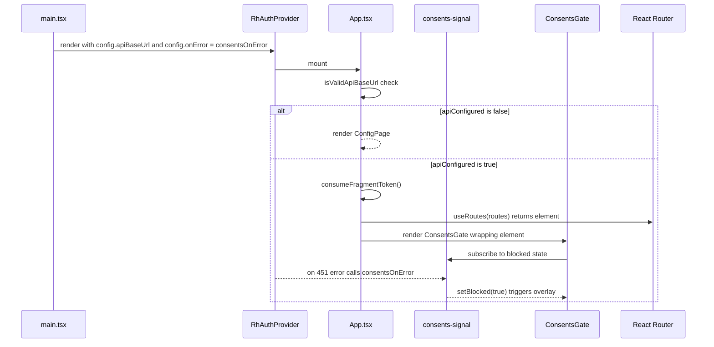

# Architecture Overview

This page explains how the application boots, authenticates users, routes requests, enforces consents acceptance, and gates unconfigured deployments.

## App Bootstrap

The following diagram shows the startup sequence from `main.tsx` through to first route render.



Bootstrap sequence from `main.tsx` through auth provider, config validation, consents gate, and route rendering.

## Component Tree

```
<StrictMode>
  <BrowserRouter>
    <RhAuthProvider config={{ apiBaseUrl, onError: consentsOnError }}>
      <App />                         ← fragment token capture + config gate
        ├── <ConfigPage />            ← if apiUrl is invalid (early return)
        └── <ConsentsGate>            ← wraps route output; shows overlay on 451
              └── useRoutes(routes)   ← React Router route tree
                    ├── PublicGuard → Login / Signup / Verify / ForgotPassword / ResetPassword
                    ├── Accept (no guard — works signed-in or out)
                    └── AuthGuard → Shell (authenticated frame)
                          └── <Outlet /> → Home / Teams / NewTeam / TeamDetail / Account
    </RhAuthProvider>
  </BrowserRouter>
</StrictMode>
```

The entrypoint is `src/main.tsx`, which renders `<RhAuthProvider>` from `@ulabase/kit-react` wrapping the entire app. The provider's `config.onError` is set to `consentsOnError` so that 451 responses raise the consents blocked flag. The provider manages auth state (user, teams, tokens) and exposes it via the [`useAuth()` hook](../domain/auth-and-teams.md).

## Auth Provider

`RhAuthProvider` receives `config={{ apiBaseUrl: environment.apiUrl, onError: consentsOnError }}` and provides:

### Properties

- **`auth.user`** — the authenticated user object (with `profile.name`, `profile.surname`, `_id`)
- **`auth.teams`** — array of `TeamMembership` objects (each with `id.$oid`, `name`, `role`, `active`)
- **`auth.isAuthenticated`** — boolean indicating whether the user is currently signed in

### Authentication

- **`auth.login(email, password)`** — email/password login
- **`auth.logout()`** — sign out
- **`auth.register({ teamName, firstName, lastName, email, password })`** — create account and default team
- **`auth.checkSession()`** — validate current session, returns user or null
- **`auth.forgotPassword(email)`** — request password reset email
- **`auth.resetPassword({ email, token, password })`** — set new password with reset token
- **`auth.verify(email, token)`** — verify email address, returns redirect URL

### Invitations

- **`auth.activate({ email, token, password })`** — activate new user from invitation
- **`auth.acceptInvite(token)`** — accept invitation for existing user
- **`auth.getInvitation(email, token)`** — fetch invitation details

### Team Management

- **`auth.loadTeams()`** — fetch team memberships, returns the updated array
- **`auth.switchTeam(teamId)`** — switch active team
- **`auth.createTeam(name)`** — create a new team
- **`auth.updateTeam({ name, description })`** — update team settings
- **`auth.deleteTeam()`** — delete the active team (owner only, no members remaining)
- **`auth.listTeamMembers()`** — list members of the active team
- **`auth.listInvitations()`** — list pending invitations for the active team
- **`auth.invite(email, role)`** — send team invitation
- **`auth.resendInvite(email)`** — resend a pending invitation
- **`auth.removeMember(email)`** — remove a member from the active team
- **`auth.updateMemberRole(email, role)`** — change a member's role

### User Profile

- **`auth.updateProfile({ firstName, lastName })`** — update user profile
- **`auth.changePassword(currentPassword, newPassword)`** — change password

### Data Access

- **`auth.api(path)`** — authenticated `fetch` wrapper; attaches the bearer token automatically and rejects non-2xx responses as `ApiError({ status, message })`. Use this for your app's own collections — see [Auth & Teams](../domain/auth-and-teams.md#reading-your-own-data).

Token management (`setToken`, `scheduleRefresh`) is also provided by the kit and is called during [fragment token capture](#fragment-token-capture).

## Consents Gate

A server-side Guards rule on the Ulabase service blocks every request from a user who has not accepted the current Terms of Service and Privacy Policy, responding with HTTP `451`. Because `/users/me` is among those requests, session restoration trips the gate on first load — there is nothing to probe separately.

### consents-signal (pub/sub)

`src/consents-signal.ts` is a module-level pub/sub that translates 451 errors into a `blocked` flag:

- **`consentsOnError`** — passed as `config.onError` to `RhAuthProvider`; when it receives an `ApiError` with `status === 451`, it calls `setBlocked(true)`.
- **`setBlocked(next)`** — updates the module-level boolean and notifies all listeners.
- **`subscribe(listener)`** — registers a callback; returns an unsubscribe function.
- **`isBlocked()`** — reads the current flag.

Because session restoration errors are absorbed by the provider, `consentsOnError` is the only place that distinguishes "blocked by consents" from "not signed in."

### ConsentsGate component

`ConsentsGate` (`src/ConsentsGate.tsx`) sits above the router in the component tree — that placement is the point. A blocked user has no valid session (the session check itself is refused), so `AuthGuard` would bounce them to login and they would never see an acceptance screen.

On mount, it subscribes to `consents-signal`. When `blocked` is `true`, it replaces the entire app with an overlay presenting:

1. Checkboxes for Terms of Service and Privacy Policy
2. An "I accept" button that calls `auth.acceptConsents()` then `auth.checkSession()` to reload the session with a fresh token
3. A "Sign out" button that clears the blocked flag and logs out

The overlay is user experience, not enforcement: removing it with devtools does not bypass the server rule. Bumping document versions in the Guards rule requires no client change — the server decides what is being accepted.

## Routing Strategy

Routes are defined in `src/routes.tsx` using React Router v6's `RouteObject[]` array with `useRoutes()`. Key design decisions:

### Lazy Loading

Every page component is imported with `lazy()` and wrapped in a `<Suspense fallback={null}>`. This produces one chunk per page:

```typescript
const Login = lazy(() => import('./pages/auth/login/Login'));
const Shell = lazy(() => import('./pages/shell/Shell'));
// ... etc
```

### Feature-Flag Gating

Routes are conditionally included in the array based on [feature flags](../domain/auth-and-teams.md#feature-flags) from `src/environments/environment.ts`:

```typescript
const { emailRegistration, passwordReset, oauthLogin, teamInvitations } = environment.features;

// Signup route only if email registration or OAuth is enabled
...(emailRegistration || oauthLogin ? [{ path: 'auth/signup', ... }] : []),
// Password reset routes only if passwordReset is enabled
...(passwordReset ? [{ path: 'auth/forgot-password', ... }, { path: 'auth/reset-password', ... }] : []),
// Invitation route only if teamInvitations is enabled
...(teamInvitations ? [{ path: 'invitations/accept', ... }] : []),
```

A flag that is `false` removes both the route and the corresponding UI (links, buttons) from the app.

### Route Guards

| Guard | Behavior |
|-------|----------|
| `PublicGuard` | Renders children only when the user is **not** authenticated; redirects to `/` if already logged in |
| `AuthGuard` | Renders children only when the user **is** authenticated; redirects to `/auth/login` if not |

`Accept` (invitation page) has **no guard** — it works whether the user is signed in or out, which is required because invitation links are opened from email.

### Catch-All

`{ path: '*', element: <Home /> }` redirects any unknown path to the home page (which itself is behind `AuthGuard`).

## Fragment Token Capture

After an OAuth redirect, the auth provider returns the access token in the URL **fragment** (`#access_token=...`). `App.tsx` calls `consumeFragmentToken()` on mount:

1. Reads `window.location.hash`
2. Extracts `access_token` from the fragment parameters
3. Calls `setToken(accessToken)` and `scheduleRefresh({ apiBaseUrl })`
4. Also checks for `?flow=signup` query param and sets the `justSignedUp` flag (via `src/just-signed-up.ts`)
5. Cleans the URL with `history.replaceState` to remove the hash and query params

This runs once on app load, inside a `useEffect` with an empty dependency array.

## Config Gating

`App.tsx` validates `environment.apiUrl` with `isValidApiBaseUrl()` from the kit. If the URL is not a valid Ulabase service address:

- A `<ConfigPage>` is rendered instead of the route tree (and therefore instead of `ConsentsGate`)
- An error is logged to the console
- The app is effectively locked until `apiUrl` is fixed

This prevents confusing failures when someone clones the repo but forgets to configure the service URL.

## See Also

- [Auth & Teams](../domain/auth-and-teams.md) — detailed auth flows, team management, and feature flag definitions
- [Operations & Runbook](../operations/runbook.md) — how to configure `environment.ts` and the styling system
- [Source Map](../source-map.md) — file-by-file inventory
