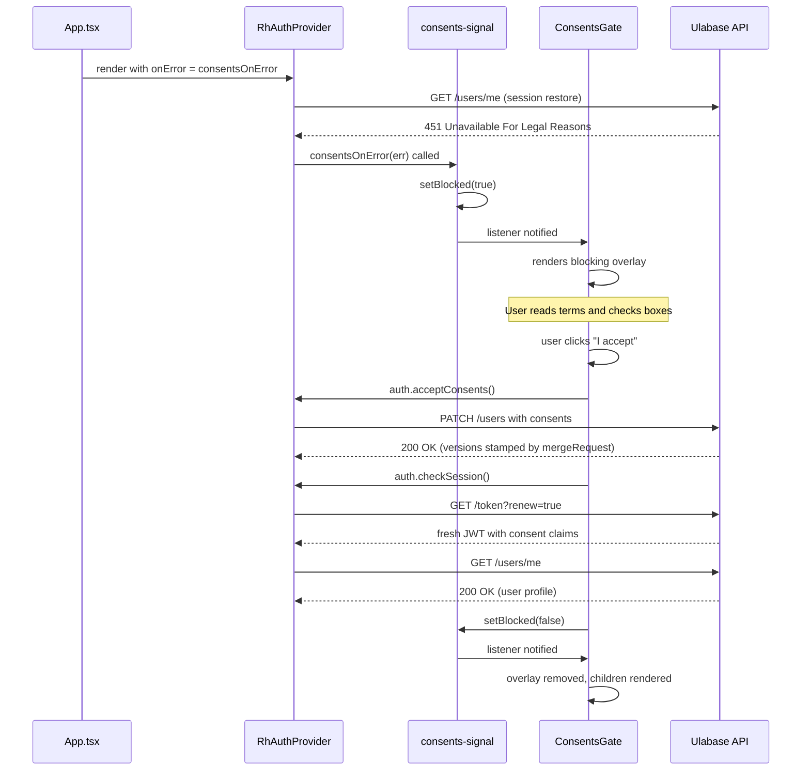

# Auth & Teams

This page documents every authentication and multi-tenancy flow implemented in the starter. All auth logic is provided by `@ulabase/kit-react` through the [`RhAuthProvider`](../architecture/overview.md#auth-provider) and the `useAuth()` hook.

## Authentication Flows

### Login

**Route:** `/auth/login` · **Guard:** `PublicGuard` · **File:** `src/pages/auth/login/Login.tsx`

The login page renders:
1. **OAuth buttons** (if `oauthLogin` feature flag is on) via the `OAuthButtons` component
2. An "OR" divider
3. **Email/password form** with inline validation:
   - Email: must contain `@` (checked on blur)
   - Password: required (checked on blur)
   - Submit calls `auth.login(email, password)`, then `navigate('/')`
   - 401 → "Invalid email or password."
   - Other errors → displays the error message
4. Links to signup (`/auth/signup`) and forgot password (`/auth/forgot-password`)

The page also checks for an `error` search param on load — if `error=invalid_token`, it shows "This link is invalid or has expired." (used when the kit redirects back after a failed OAuth or token flow).

Loading state disables the submit button. Password visibility toggle is provided.

### Signup

**Route:** `/auth/signup` · **Guard:** `PublicGuard` · **Shown when:** `emailRegistration || oauthLogin` · **File:** `src/pages/auth/signup/Signup.tsx`

Registration form collecting first name, last name, email, and password (minimum 8 characters). OAuth buttons are shown above the form when `oauthLogin` is enabled. On submit:

1. Auto-generates a team name: `{firstName}'s Team`
2. Calls `auth.register({ teamName, firstName, lastName, email, password })`
3. On success → shows a "Check your email" confirmation screen (no redirect)
4. On 409 → "An account with this email already exists."

The [`justSignedUp`](#just-signed-up-flag) flag exists in `App.tsx` for cases where an external flow (e.g., OAuth callback) sets `?flow=signup` in the URL, but the signup form itself does not trigger it.

### Email Verification

**Route:** `/auth/verify` · **Guard:** `PublicGuard` · **Shown when:** `emailRegistration` · **File:** `src/pages/auth/verify/Verify.tsx`

Handles the verification link from the signup confirmation email. Reads `email`, `token`, and `error` from URL search params:

1. **Missing params** (`email` or `token` absent) → shows "Invalid link" with a back-to-login link
2. **Error param present** → shows "Verification failed — link is invalid or has expired"
3. **Valid params** → calls `auth.verify(email, token)`, which returns a URL, then redirects the browser to it (`window.location.href = url`)

### Password Reset

**Routes:** `/auth/forgot-password`, `/auth/reset-password` · **Guard:** `PublicGuard` · **Shown when:** `passwordReset`

Two-step flow:
1. **ForgotPassword** (`src/pages/auth/forgot-password/ForgotPassword.tsx`) — user enters email. The API returns 202 regardless of whether the email exists (to avoid leaking registered addresses). On submit → shows "Check your email" confirmation. Calls `auth.forgotPassword(email)`.
2. **ResetPassword** (`src/pages/auth/reset-password/ResetPassword.tsx`) — user clicks email link with `?email=...&token=...` query params. If params are missing → "Invalid link". Otherwise shows a password form (minimum 8 characters). Calls `auth.resetPassword({ email, token, password })`. On 401 → "This reset link is invalid or has expired." On success → navigates to `/`.

### OAuth Login

**File:** `src/pages/auth/oauth-buttons/OAuthButtons.tsx`

OAuth is initiated by navigating to `${apiUrl}/auth/oauth/authorize/${provider}?noauthchallenge`. The `oauthUrl()` helper in `src/oauth-url.ts` builds this URL.

After the OAuth provider authenticates the user, they are redirected back with an access token in the URL **fragment** (`#access_token=...`). The [fragment token capture](../architecture/overview.md#fragment-token-capture) in `App.tsx` picks this up.

**Supported providers:** Configured in `environment.features.oauthProviders` array. Currently `['google']`. Add `'github'` or others as your Ulabase service supports them.

## Invitations

**Route:** `/invitations/accept` · **Guard:** none (works signed-in or out) · **Shown when:** `teamInvitations` · **File:** `src/pages/invitations/accept/Accept.tsx`

Invitation links arrive via email with `?email=...&token=...` query params. The page handles three cases:

### Flow 1: Missing Parameters

If `email` or `token` is missing from the URL, an "Invalid invitation link" error is shown immediately.

### Flow 2: New User (not yet registered)

On load, `auth.getInvitation(email, token)` is called. If `invitation.isNewUser === true`:
- Shows "Join {teamName}" heading
- Password form (minimum 8 characters) with inline validation
- Submit calls `auth.activate({ email, token, password })` which both creates the account and accepts the invitation
- On success → navigates to `/`

### Flow 3: Existing User

If `invitation.isNewUser === false`:
- Shows "Accept invitation to {teamName}"
- If already logged in → one-click "Accept" button calls `auth.acceptInvite(token)`
- If not logged in → password form, submit logs in then calls `auth.acceptInvite(token)`
- On success → shows "You're in" and redirects to `/` after 1.2 seconds

Error handling:
- 404 → "This invitation is invalid or has expired."
- 401 → "Invalid password."
- Other → display the error message

## Team Management

**Files:** `src/pages/teams/Teams.tsx`, `src/pages/teams/detail/TeamDetail.tsx`, `src/pages/teams/new/NewTeam.tsx`

### Team List (`/teams`)

- Calls `auth.loadTeams()` on mount
- Renders each team with name, description, role
- Active team gets a "current" badge; inactive teams get a "Switch" button
- "New team" link at top
- Empty state: "You're not part of any team yet."

### Team Switching

`auth.switchTeam(teamId)` — called from the team list. The team switcher in the Shell header is only shown when the user belongs to more than one team.

### Team Detail (`/teams/:id`)

**File:** `src/pages/teams/detail/TeamDetail.tsx`

Full team management page, owner-only sections are gated by `team.role === 'owner'`:

- **Members** — lists all team members with name, email, and role. Owners can change member roles (member ↔ owner) and remove members (with confirmation).
- **Invite a team member** (owner only) — form with email and role selection. Calls `auth.invite(email, role)`. Shows 409 error for duplicate members.
- **Pending invitations** (owner only) — lists pending invites with role, date, and expired status. "Resend" button with a 5-minute cooldown per invite.
- **Team settings** (owner only) — form to edit team name and description. Calls `auth.updateTeam()`.
- **Delete team** (owner only) — confirmation dialog, calls `auth.deleteTeam()`, then loads remaining teams and switches to the first one.

All data loads via `auth.listTeamMembers()` and `auth.listInvitations()` on mount alongside `auth.loadTeams()`.

### New Team (`/teams/new`)

**File:** `src/pages/teams/new/NewTeam.tsx`

Form to create a new team. Calls `auth.createTeam(teamName)` and navigates to `/teams` on success.

## Just-Signed-Up Flag

**File:** `src/just-signed-up.ts`

A simple module-level boolean:
- `setJustSignedUp(true)` is called in `App.tsx` when `?flow=signup` is detected
- Shell reads `isJustSignedUp()` on mount to show a welcome message
- Shell calls `setJustSignedUp(false)` immediately after reading (one-shot)

This avoids passing state through React context for a transient UI effect.

## Consents Gate

Every user must accept the current Terms of Service and Privacy Policy before they can use the app. The gate has two halves: a server-side rule that blocks requests, and a client-side overlay that presents the acceptance form.

### Server-Side Enforcement

A **Guards** rule on the Ulabase service blocks every authenticated request from a user whose JWT does not carry the current consent versions, responding with HTTP `451 Unavailable For Legal Reasons`. The rule applies to this app, a mobile client, `curl`, and any API integration — not just to the code below.

The rule's condition:

1. **`@authenticated = 'true'`** — anonymous callers are excluded so public pages, webhooks, and catalogue browsing keep working.
2. **`not path-prefix('/auth')`** — signing in must stay open or a blocked user cannot re-authenticate.
3. **`not path-prefix('/token')`** — same reasoning for token renewal.
4. **`not (method(PATCH) and path-template('/users/{userId}') and bson-request-whitelist(consents))`** — the acceptance PATCH itself, made while still blocked.
5. **`not (equals(@user.latestConsents.tos, '…') and equals(@user.latestConsents.pp, '…'))`** — the version check. Both must match.

Crucially, `/users/me` is **not** excluded. Blocking it is what makes the gate work with zero probing on the client side: reading the user document is the first thing any app does on load, so session restoration trips the gate before anything else happens.

The permission on `PATCH /users/{userId}` uses a `mergeRequest` to stamp the versions and timestamp server-side — the client sends `{"consents": []}` and states nothing about which versions are being accepted.

The schema (`userConsentsSchema`) defines `latestConsents` (with `tos`, `pp`, and `acceptedAt`) and `consents` (the history array). Neither field is in `required` because registration does not write them.

Two JWT claims — `latestConsents/tos` and `latestConsents/pp` — carry the versions in the token so the rule can read them without a database round-trip. If either claim is missing, every authenticated user is blocked permanently.

<!-- openwiki: broken internal link [../ulabase.setup.consents.ts] file "../ulabase.setup.consents.ts" does not exist. Fix the href or restore the target, then delete this comment. -->
<!-- openwiki: broken internal link [../README.md#3-set-the-service-up] file "../README.md" does not exist. Fix the href or restore the target, then delete this comment. -->
The setup file [`ulabase.setup.consents.ts`](../ulabase.setup.consents.ts) creates all four documents (schema, permission, claims, rule) with versions derived from a single pair of constants. The [README](../README.md#3-set-the-service-up) documents how to apply it.

### Client-Side Pub/Sub

`src/consents-signal.ts` is a module-level pub/sub that translates 451 errors into a `blocked` flag:

- **`consentsOnError(err)`** — passed as `config.onError` to `RhAuthProvider`; when it receives an `ApiError` with `status === 451`, it calls `setBlocked(true)`.
- **`setBlocked(next)`** — updates the module-level boolean and notifies all listeners.
- **`subscribe(listener)`** — registers a callback; returns an unsubscribe function.
- **`isBlocked()`** — reads the current flag.

Session restoration errors are absorbed by the provider (`checkSession().catch(() => null)`) to keep the app usable when the user is simply signed out. `consentsOnError` is the only hook that sees *why* the session check failed — without it, "blocked by consents" and "not signed in" are indistinguishable.

### Client-Side Overlay

`ConsentsGate` (`src/ConsentsGate.tsx`) wraps the router in `App.tsx` — **above `AuthGuard`**. That placement is the point: a blocked user has no session (`/users/me` is refused), so `AuthGuard` would bounce them to the login page and they would never see the acceptance screen.

On mount, it subscribes to `consents-signal`. When `blocked` is `true`, it replaces the entire app with a blocking overlay presenting:

1. Checkboxes for Terms of Service and Privacy Policy (links to `/terms.html` and `/privacy.html`)
2. An "I accept" button — gated behind both checkboxes
3. A "Sign out" button that clears the blocked flag and logs out

The overlay is user experience, not enforcement — remove it with dev tools and every request still comes back `451`. The rule lives on the server.

### Acceptance Flow

When the user clicks "I accept", the component calls:

1. **`auth.acceptConsents()`** — PATCHes `/users` with `{"consents": []}`. The permission's `mergeRequest` stamps the current `TOS_VERSION` and `PP_VERSION` onto `latestConsents` and pushes to the `consents` history array. Nothing in the request body states which versions are being accepted — the server decides.
2. **`auth.checkSession()`** — fetches a fresh JWT (via `/token?renew=true`) then re-reads `/users/me` and calls `setUser()`. The renewal is not optional: a JWT is a snapshot, and without a fresh one the rule keeps blocking the user for the life of the old token.
3. **`setBlocked(false)`** — tears down the overlay so the app renders with the new session.

If the PATCH or renewal fails, a "We could not record your acceptance" error is shown; the user can retry.

### Version Management

Versions are defined in one place inside `ulabase.setup.consents.ts`:

```typescript
const TOS_VERSION = '2026-07-01';
const PP_VERSION  = '2026-07-01';
```

Everything is derived — the permission's `mergeRequest` references them, the rule's condition compares against them. Publishing new terms means editing two strings in the setup file and re-running it; every user meets the acceptance form again on their next request.

The `Version 2026-07-01` line at the top of `public/terms.html` and `public/privacy.html` is the third place, and the only one left to keep in step by hand.

### Legal Documents

`public/terms.html` and `public/privacy.html` are **placeholders — replace them** before going to production. Plain HTML, no build step, no framework.

They are static files rather than app routes on purpose: a blocked user has no session, so anything routed through the app would sit behind the gate they are trying to read their way out of. A file in `public/` is served to anyone, in any state, and opens in a new tab without booting the app at all.

### Consents Flow Diagram



End-to-end consents flow: from app load through session restoration, 451 interception, acceptance, token renewal, and overlay teardown.

## Feature Flags

**File:** `src/environments/environment.ts`

```typescript
features: {
  emailRegistration: true,    // Enables signup + email verification routes
  passwordReset: true,        // Enables forgot-password + reset-password routes
  oauthLogin: true,           // Enables OAuth buttons on login/signup
  oauthProviders: ['google'], // Which OAuth providers to show
  teamInvitations: true,      // Enables /invitations/accept route
}
```

These flags must match your Ulabase service's **Sign-up Mgmt → Features** toggles. When a flag is `false`:
- The corresponding route is removed from the route array
- UI elements (links, buttons) that reference the disabled flow are not rendered

## Reading Your Own Data

Everything the starter does talks to `/auth/*`, `/token`, and `/users/me` — the kit handles those. For your application's own collections, use `auth.api()`:

```tsx
import { useAuth } from '@ulabase/kit-react';
import type { ApiError } from '@ulabase/kit-react';

function Notes() {
  const auth = useAuth();
  const [notes, setNotes] = useState<unknown[]>([]);
  const [error, setError] = useState<string | null>(null);

  useEffect(() => {
    auth.api('/notes?pagesize=10')
      .then(res => res.json())
      .then(setNotes)
      .catch((err: ApiError) => setError(err.message));
  }, [auth.api]);

  // ...
}
```

Pass a path, not a full URL. `auth.api()` attaches the bearer token automatically and rejects non-2xx responses with `ApiError({ status, message })`. A `451` from the consents rule or a `403` from an ACL is something you branch on rather than parse. A plain `fetch` to the same URL is unauthenticated — the service answers 401.

The [Home page](../source-map.md#home) includes a working "Fetch /demo" button that demonstrates this pattern.

## See Also

- [Architecture Overview](../architecture/overview.md) — how the auth provider, routing, and consents gate work
- [Operations & Runbook](../operations/runbook.md) — how to configure feature flags, environment, and styling
