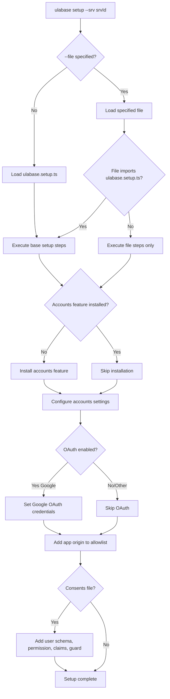

# Service Setup with Ulabase CLI

This page documents how the Ulabase React starter configures its backend service declaratively using the `ulabase` CLI. The setup is idempotent — each step checks current state before applying changes — and the feature flags flow from `environment.ts` to the service automatically.

## CLI Installation and Authentication

```bash
npm install -g ulabase
ulabase login                              # paste a token from ulabase.com
```

The CLI authenticates against Ulabase and stores a token locally. All subsequent commands use this token.

## Setup Workflow

### Basic Setup

```bash
ulabase setup --srv <srvId>                # apply all steps
ulabase setup --srv <srvId> --dry-run      # check only, report what's missing
ulabase setup --srv <srvId> --file ulabase.setup.consents.ts   # with consents gate
```

The `<srvId>` is the six-character identifier from your service URL (e.g., `abc123` in `https://abc123.ulabase.app`). Every step is check-then-apply: running it twice writes nothing.

### Setup Decision Tree



Decision tree for ulabase setup showing how file selection determines which configuration steps execute.

## Base Setup File: `ulabase.setup.ts`

The base setup file (`ulabase.setup.ts`) imports `environment.ts` to derive server configuration from the app's feature flags. This eliminates configuration drift between frontend and backend.

### Feature Flag Flow

The `features` block in `environment.ts` must match the service's "Sign-up Mgmt → Features" toggles. `ulabase.setup.ts` reads these flags and configures the service accordingly:

```typescript
// From environment.ts
export const environment = {
  apiUrl: '',
  features: {
    emailRegistration: true,
    passwordReset: true,
    oauthLogin: true,
    oauthProviders: ['google'] as const,
    teamInvitations: true,
  },
};
```

The setup file derives server toggles:

```typescript
const f = environment.features;

const features = {
  registration: f.emailRegistration,
  verification: f.emailRegistration,
  'password-reset': f.passwordReset,
  invitations: f.teamInvitations,
  oauth: f.oauthLogin,
};
```

### Setup Steps

1. **Accounts Feature Installation** — Installs the `accounts` feature if not present. Uses `409` response to detect "already installed" as success.

2. **Accounts Configuration** — Sets `app-name`, `frontend-url`, and all feature flags. The `frontend-url` determines where verification, reset, and invitation emails link to.

3. **Google OAuth Credentials** — Conditional step: only executes when `oauthLogin` is `true` and `oauthProviders` includes `'google'`. Uses `fromEnv()` to read `GOOGLE_CLIENT_ID` and `GOOGLE_CLIENT_SECRET` from environment variables, but only when credentials aren't already stored.

4. **Origin Allowlist** — Adds the `APP_URL` (default `http://localhost:5173`) to the service's allowed origins. Additive: never replaces existing origins, only adds missing ones.

## Consents Gate Setup: `ulabase.setup.consents.ts`

The consents gate file imports the base setup and appends four additional steps for requiring Terms of Service and Privacy Policy acceptance.

### Version Constants

```typescript
const TOS_VERSION = '2026-07-01';
const PP_VERSION = '2026-07-01';
```

These versions appear in both the permission's `mergeRequest` and the guard rule's condition. They must match exactly; mismatched versions block users permanently.

### Additional Setup Steps

1. **User Schema** (`userConsentsSchema`) — Defines the user document shape with `latestConsents` and `consents` fields. Uses `_$date` BSON escaping for date fields. Note: `latestConsents` and `consents` are NOT required (they'd reject registrations).

2. **Permission** (`userCanPatchOwnConsents`) — Allows users to PATCH their own `consents` field. The server stamps versions and timestamps via `mergeRequest`, preventing clients from accepting terms they weren't shown.

3. **JWT Claims** — Adds `latestConsents/tos` and `latestConsents/pp` to the token payload. The guard reads the token, not the database.

4. **Guards Rule** (`consentsGate`) — Blocks authenticated users with HTTP 451 (Unavailable For Legal Reasons) when either acceptance is missing or outdated. Excludes:
   - Anonymous requests (`@authenticated = 'false'`)
   - Auth paths (`/auth/*`)
   - Token paths (`/token/*`)
   - The acceptance itself (`PATCH /users/{userId}` with `consents` field)

### Why the Gate Works Without Client Code

The client code for showing the acceptance dialog is always present. When the guard rule doesn't exist, no request returns 451, so the dialog never appears. The absence of a rule is the absence of the gate.

## Operational Procedures

### Bumping Consent Versions

When publishing new Terms or Privacy Policy:

1. Edit `TOS_VERSION` and/or `PP_VERSION` in `ulabase.setup.consents.ts`
2. Update the version lines in `public/terms.html` and `public/privacy.html`
3. Re-run setup: `ulabase setup --srv <srvId> --file ulabase.setup.consents.ts`

Existing users see the acceptance form again on their next request. Previous acceptances remain in the `consents` history.

### Adding OAuth Providers

1. Add the provider to `oauthProviders` in `environment.ts`:
   ```typescript
   oauthProviders: ['google', 'github'] as const,
   ```
2. Set the corresponding environment variables (e.g., `GITHUB_CLIENT_ID`, `GITHUB_CLIENT_SECRET`)
3. Re-run setup: `ulabase setup --srv <srvId>`

### Changing the App URL

1. Edit `APP_URL` in `ulabase.setup.ts` (or set the `APP_URL` environment variable)
2. Re-run setup: `ulabase setup --srv <srvId>`

This updates `frontend-url` (email links) and adds the new origin to the allowlist.

## Troubleshooting

**Everything fails, and the console says the origin is not allowed.** Re-run `ulabase setup` after changing where the app is served from.

**A page is missing and its link is gone.** The feature flags in `environment.ts` must match the service's toggles. Re-running setup usually fixes this.

**`401` on a request you wrote yourself.** Use `auth.api()`, which attaches the session — a plain `fetch` doesn't.

**Users blocked permanently after accepting.** Check that `TOS_VERSION`/`PP_VERSION` match between the permission's `mergeRequest` and the guard rule's condition. Re-run setup to synchronize.
