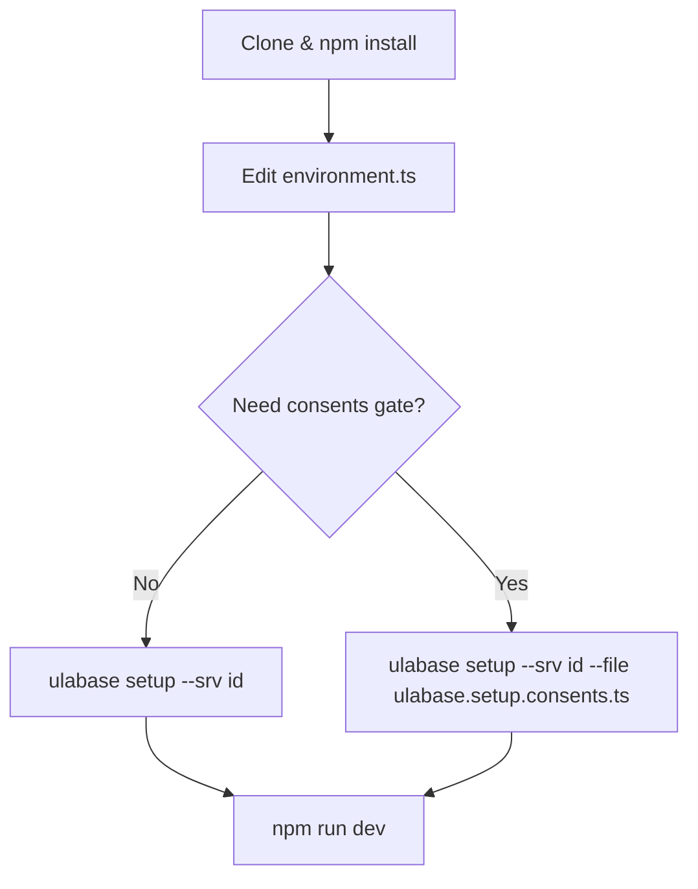

# Ulabase Starter — React

A React app with sign-up, login, Google and GitHub sign-in, email verification, password reset,
teams and invitations — working, not sketched. Clone it, point it at a free
[Ulabase](https://ulabase.com) service, and you have the boring half of an
application already done.

Works for multi-tenant SaaS (invitations, team switcher) and simpler apps (auth only).
There is no server of yours to write, deploy, or pay for.

## What's Included

- **Signup, login, logout** — email/password and Google OAuth
- **Email verification, password reset**
- **Team invitations** — one page (`/invitations/accept`) branching into a new-user "set password" form (calls `PATCH /auth/activate`) or an existing-user "log in and accept" form
- **Team switcher** — shown only when the user belongs to more than one team
- **Consents gate** — optional server-side enforcement: users must accept Terms of Service and Privacy Policy before using the app (status `451` from a Guards rule)
- **Authenticated shell** with placeholder for your app content
- **Lazy-loaded routes** with code splitting

## Quick Setup

Two paths, one app. Choose based on whether you need the consents gate.



The two setup paths through the Ulabase CLI. Both are idempotent check-then-apply.

### Prerequisites

1. A **free Ulabase service** — [create one at ulabase.com](https://ulabase.com).
2. [Node.js](https://nodejs.org) 18 or later.

### 1. Clone and install

```bash
git clone https://github.com/ulabase/starter-react.git
cd ulabase-starter-react
npm install
```

### 2. Point to your service

Create a free service at [ulabase.com](https://ulabase.com) and copy its URL
from the service's *Connect* page. Put it in `src/environments/environment.ts`:

```ts
apiUrl: 'https://xxxxxx.ulabase.app',
```

> Use the URL of **your service**, not `api.ulabase.com`. That second one is Ulabase's own
> control panel, and pointing the app at it makes every request fail.

To keep that edit out of `git status`:

```bash
git update-index --assume-unchanged src/environments/environment.ts
```

### 3. Set the service up

The app needs things of its service: the accounts feature installed, sign-up and password reset
switched on, your origin allowed to call it. The `ulabase` CLI puts them there from a setup file
in this repo, so there is no console checklist to follow.

```bash
npm install -g ulabase
ulabase login                              # paste a token from ulabase.com
ulabase setup --srv <srvId>                # uses ulabase.setup.ts by default
```

`<srvId>` is the six-character id of your service — the first label of its URL. Every step is a
check and an apply, so running it twice writes nothing. `--dry-run` tells you what a service is
missing without touching it.

**What `ulabase.setup.ts` does:**

| Step | Effect |
|------|--------|
| Accounts feature installed | Installs the `accounts` plugin if missing |
| Accounts configured to match the app | Syncs feature flags (`emailRegistration`, `passwordReset`, `teamInvitations`, `oauthLogin`) from `environment.ts`, plus `app-name` and `frontend-url` |
| Google OAuth credentials | When `oauthLogin` is on and `google` is in `oauthProviders`, ensures `client-id` and `client-secret` are set (reads `GOOGLE_CLIENT_ID` / `GOOGLE_CLIENT_SECRET` env vars) |
| App origin allowed | Installs `origin-allowlist` and adds the app URL |

Feature flags in `environment.ts` are the single source of truth — the setup reads them and
configures the service to match. Re-running after changing flags keeps the two in sync.

#### Optional: add the consents gate

Want users to accept Terms of Service and a Privacy Policy before they can use the app? Use the
consents setup file instead:

```bash
ulabase setup --srv <srvId> --file ulabase.setup.consents.ts
```

This imports all steps from `ulabase.setup.ts` (so the accounts configuration cannot drift) and
appends four more documents:

| Step | Effect |
|------|--------|
| User schema stored | Adds `userConsentsSchema` allowing `latestConsents` and `consents` fields |
| Users collection validated | Binds the schema to `/users` via `jsonSchema.schemaId` |
| Consent permission | Grants `user` role a scoped `PATCH /users/{userId}` for consents only, with a `mergeRequest` that stamps versions server-side |
| JWT claims | Adds `latestConsents/tos` and `latestConsents/pp` so the Guards rule can read them from the token |
| Guards rule | Blocks authenticated users with `451` when either version does not match — excludes `/auth`, `/token`, and the acceptance PATCH |

Without this file, no request is ever answered `451`, so the consents overlay never renders.
The app carries the client code either way — an unasked question is the absence of a rule on
the server, not a flag in the client.

Either way, replace `public/terms.html` and `public/privacy.html` — they are placeholders.

For a full walkthrough of the consents gate (server-side enforcement, client-side overlay,
version management), see [Auth & Teams](domain/auth-and-teams.md) and
[Service Setup](operations/service-setup.md).

### 4. Start it

```bash
npm run dev
```

Sign up, check your inbox, and you are in.

### NPM Scripts

| Script | Purpose |
|--------|---------|
| `npm run dev` | Start Vite dev server |
| `npm run build` | Type-check (`tsc -b`) then produce `dist/` |
| `npm run preview` | Serve the production build locally |
| `npm test` | Run tests with Vitest |

## Feature Flags

The `environment.ts` file contains feature flags that control which routes and UI elements are
available. These flags must match your service's *Sign-up Mgmt → Features* toggles.

| Flag | Default | Effect |
|------|---------|--------|
| `emailRegistration` | `true` | Enables signup and email verification routes |
| `passwordReset` | `true` | Enables forgot/reset password routes |
| `oauthLogin` | `false` | Enables OAuth login buttons (Google, GitHub) |
| `oauthProviders` | `['google']` | Array of OAuth providers to display |
| `teamInvitations` | `true` | Enables team invitation acceptance route |

**To add GitHub OAuth:** Update `oauthProviders` to include `'github'` and run setup with
GitHub credentials:

```bash
GITHUB_CLIENT_ID=… GITHUB_CLIENT_SECRET=… ulabase setup --srv <srvId>
```

## Project Structure

```
src/
  main.tsx                ← Entrypoint: RhAuthProvider + BrowserRouter
  App.tsx                 ← Fragment token capture + config gate
  routes.tsx              ← Route map with lazy loading and feature-flag gating
  ConfigPage.tsx          ← Shown when apiUrl is not a valid *.ulabase.app URL
  styles.css              ← Design tokens + the DISPOSABLE default skin
  just-signed-up.ts       ← Module-level flag for post-signup welcome
  oauth-url.ts            ← OAuth authorize URL builder
  consents-signal.ts      ← The 451 flag + the onError handler that raises it
  ConsentsGate.tsx        ← The blocking overlay, mounted at the app root
  environments/
    environment.ts        ← apiUrl + feature flags
  ui/alert/               ← Shared feedback component
  pages/
    shell/                ← Authenticated frame: header, nav, user menu, theme toggle
    home/                 ← Getting-started showcase with feature flags grid and auth.api() demo — replace with your content
    auth/                 ← login, signup, verify, forgot/reset password, OAuth buttons
    invitations/accept/   ← One page, three flows (new user, logged-in, missing params)
    teams/                ← list, detail (members/invites/settings), new
    account/              ← Profile + change password
public/
  terms.html, privacy.html ← PLACEHOLDER legal documents — replace them
```

## Documentation Map

| Page | What It Covers |
|------|----------------|
| [Architecture Overview](architecture/overview.md) | Component tree, auth provider setup, routing strategy, fragment token capture, config gating, ConsentsGate placement |
| [Source Map](source-map.md) | File-by-file inventory mapping every source file to its purpose, including setup files and consents gate components |
| [Auth & Teams](domain/auth-and-teams.md) | Authentication flows, team management, invitation handling, feature flags, consents gate server-side enforcement and client-side overlay |
| [Service Setup](operations/service-setup.md) | Declarative setup workflow, `ulabase.setup.ts` and `ulabase.setup.consents.ts`, feature flag flow, consents gate server configuration, operational procedures |
| [Operations & Runbook](operations/runbook.md) | Environment config, design system/styling, build/deploy, feature flag management, consents version bumping |
| [Testing Guidance](testing/guidance.md) | Vitest setup, what to test (including consents gate), how to run |

## Key Dependencies

| Package | Role |
|---------|------|
| `@ulabase/kit-react` | Auth provider (`RhAuthProvider`), guards (`AuthGuard`, `PublicGuard`), `useAuth()` hook, token management |
| `@ulabase/cli` | `ulabase` CLI for declarative service setup (`ulabase setup --srv <srvId>`) |
| `react` | UI framework |
| `react-dom` | React renderer for the web |
| `react-router-dom` | Routing with `useRoutes`, lazy loading, nested routes |
| `vite` | Build tool and dev server |
| `vitest` | Test runner |

**Note:** `@ulabase/kit` (framework-agnostic API client) is a dependency of `@ulabase/kit-react`
and not listed directly in `package.json`.

## Something not working?

**Everything fails, and the console says the origin is not allowed.** The service only answers
pages it has been told about. Re-run `ulabase setup` after changing where the app is served from, or
add the origin under *Service → Origin Allowlist*.

**A page is missing and its link is gone.** The feature flags in `environment.ts` must match the
service's *Sign-up Mgmt → Features* toggles. `ulabase setup` reads the flags from that same file and
sets the service to match, so re-running it is usually the fix.

**`401` on a request you wrote yourself.** A plain `fetch` carries no session. Use `auth.api()`,
which attaches it — see [NOTES.md](https://github.com/ulabase/starter-react/blob/main/NOTES.md#reading-your-own-data).

**`ulabase` runs something about OpenShift.** A different, retired tool of the same name is first in
your `PATH`. `type -a ulabase` shows both.

## Backlog

- **No test files exist** — Vitest is configured but no `.test.ts` or `.spec.ts` files have been written. Source anchor: `package.json` → `"test": "vitest"`. Deferred because the project is in its initial commit phase.
- **Account page** (`pages/account/Account.tsx`) provides profile and password management — extend as needed.
- **Additional OAuth providers** — currently only `google` is configured by default; the environment supports `oauthProviders` array for GitHub, etc. See feature flags section above.
